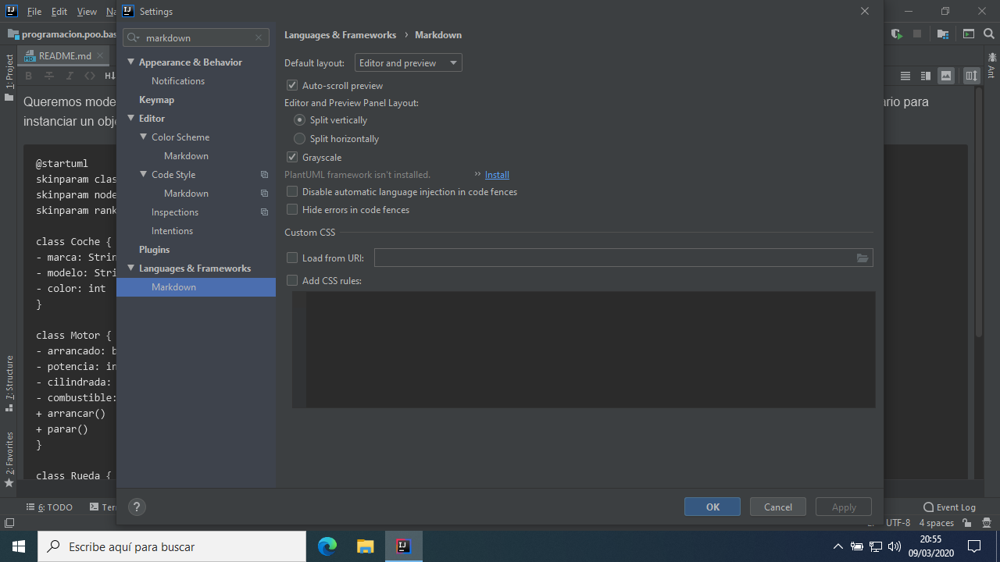

# PlantUML en IntelliJ

Configurar IntelliJ para que visualice correctamente diagramas [PlantUML](https://plantuml.com/es/).

Al abrir un proyecto cuyo README.md tenga un diagrama UML escrito en PlantUML, aparecerá así si no se han instalado las herramientas adecuadas.


> Nota: Pasos para macOS más abajo.

## Windows

1. Cerrar IntelliJ por completo.

2. Descargar [Graphviz para Windows](https://graphviz.gitlab.io/_pages/Download/Download_windows.html).
 
	
	
	
	
	

3. Instalar Graphviz (marcar Everyone en las opciones, el resto por defecto).

	
	
	
	
	

4. Copiar la ruta a la instalación de Graphviz.

	

5. Añadir la ruta copiada a la variable de entorno PATH.

	
	
	
	
	
	
	

6. Abrir IntelliJ, ir a los ajustes, buscar Languages & Frameworks -> Markdown e instalar la opción PlantUML.

	
	
	

7. Cerrar la pestaña y volver a cargar el fichero README.md.

	

## macOS

1. Cerrar IntelliJ.

2. Instalar [Homebrew](https://brew.sh).

3. Abrir un Terminal e instalar Graphviz.

	```
	brew install graphviz
	```
	
4. Ir al paso 6 de las instrucciones para Windows.
